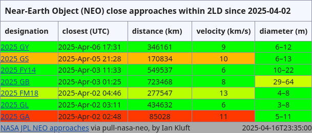
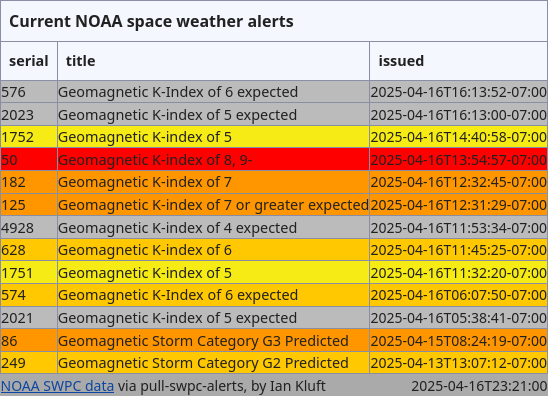

# AlertGizmo

by Ian Kluft

AlertGizmo is software which monitors for space-related events and generate summary pages.

## Source Code

It started with a [Perl implementation](src/perl) to be used as a prototype for other language implementations. The Perl modules were adapted from scripts I wrote to monitor space-related alerts online. The common code among the scripts was pulled together into the AlertGizmo module. These can be run manually, or automatically from crontabs. (An example is in the Perl source code directory.)

## To Do

Make a github.io site which displays regularly-updated data fetched and processed by AlertGizmo modules, deployed via regularly-timed GitHub Actions and formatted with browser-side code.

### Examples

